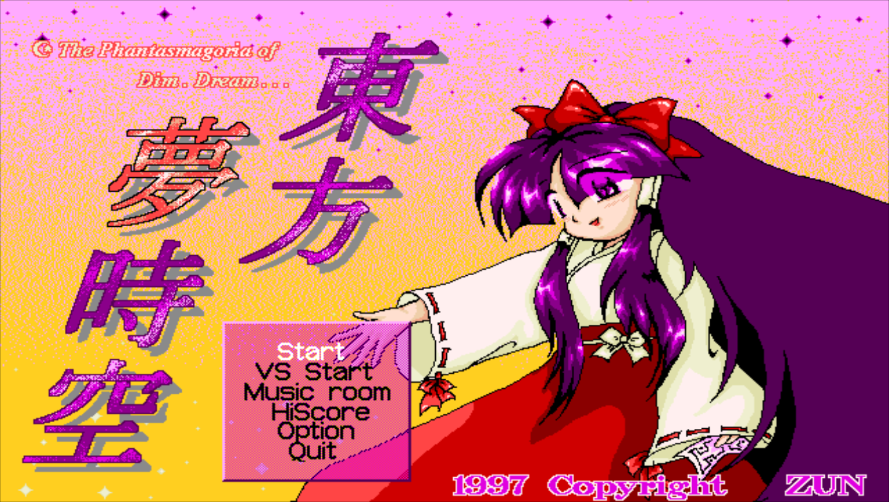
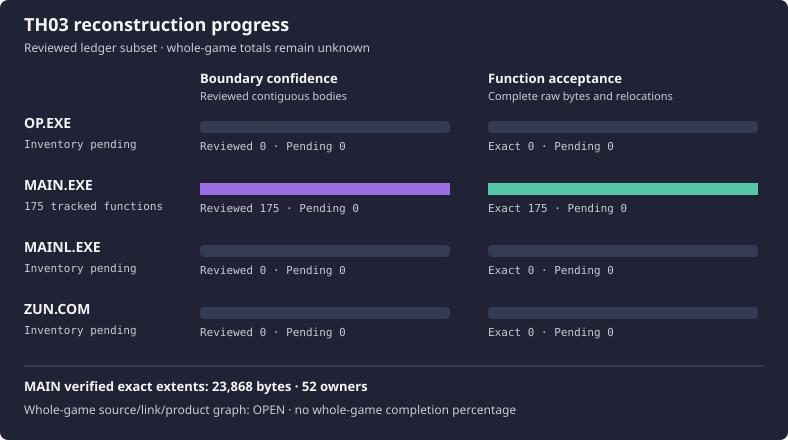

# 東方夢時空 ～ Phantasmagoria of Dim.Dream

<p align="center">
  
</p>

<p align="center">
  
</p>

This repository reconstructs the original Japanese PC-98 **Touhou 3:
Phantasmagoria of Dim.Dream**. Reconstruction resumed on 2026-10-07 after the
2026-10-06 closeout snapshot. This repository preserves maintained source and
reviewed evidence for `MAIN.EXE`, `OP.EXE`, `MAINL.EXE` and `ZUN.COM`; the complete game
reconstruction and the 505-file intake remain unfinished.

[Current handoff](docs/RE_HANDOFF.md) and the [historical closeout record](docs/CLOSEOUT.md)
are the entrypoints. MAIN has **282 exact functions / 45393 exact owned bytes**
across **58 maintained source owners and 65 exact CODE extents**. The broader
target-reviewed authored frontier is **320 functions / 51049 bytes across 72
owners**, after adding the ten Extra Attack owners in P_EXATT_TEXT and
MAIN_06_TEXT. These are scoped repository-local results, not whole-game product
closure or Factory Truth Kernel acceptance. Whole-game denominators remain
unknown until ownership is reviewed.

## Current products and navigation

- [Progress and exact ownership counts](docs/PROGRESS.md).
- [Earlier MAIN input/math checkpoint](docs/MAIN_INPUT_MATH_EXACT.md).
- [Complete review index](docs/REC98_TH03_REVIEW.md) and [bounded notes](docs/reconstruction/README.md).
- [Reconstruction workflow](docs/RE_WORKFLOW.md) and [Oracle contract](docs/ORACLES.md).
- [Headless compiler tools](docs/TOOLCHAIN.md) and [Ghidra analysis](docs/GHIDRA.md).
- [Shared Factory MCP and read-only TH04 reference](docs/FACTORY.md).
- [Script purposes and entry points](scripts/README.md).

## Build and validate

With your local inputs and pinned toolchain installed:

```sh
python3 scripts/preflight.py
python3 scripts/ghidra.py th03-main check
python3 scripts/replay_th03_main_exact_units.py --run-id NEW_UNIQUE_ID
python3 scripts/status.py
python3 scripts/ci.py
```

Run one Borland/Wine build at a time. Exact replay freezes maintained inputs,
materializes the pinned scaffold twice, recompiles all game objects, and checks
full owned bytes, MAP placement, ordered MZ relocations, OMF validity and cold
output determinism. An isolated DOS probe checks input routing/wait behavior
and signed fixed-point arithmetic using the actual maintained objects.

All compiler and analyzer invocations are headless. Private state and replay
outputs stay under `.analysis/`. `python3 scripts/clean_generated.py` is a
conservative dry run; add `--apply` after review. The optional
`--prune-unreferenced-receipts` mode also removes complete receipt runs that are
unreachable from current evidence/docs and retained JSON input guards; use
`--keep-analysis .analysis/PATH` for an active run that is not tracked yet.
Required toolchain/runtime/Ghidra state and referenced proof trees are retained.
For recorded closeout cleanup, use `scripts/closeout_cleanup.py`.
`python3 scripts/build.py --status` reports the open product graph; a complete
playable maintained game build is not available yet.

## Setup

The tools follow [TH04's reconstruction workflow](https://github.com/N0zoM1z0/th04):
pinned Turbo C++ 4.0J, TASM32 and TLINK via Wine/MS-DOS Player, plus pinned
Ghidra and a headless JDK. TH03 has independent Wine state and analyzer projects.

```sh
mkdir -p _reference
git clone https://github.com/nmlgc/ReC98.git _reference/ReC98
git -C _reference/ReC98 checkout --detach b6ba5b0a529edbb31efdf8c0e939263804f8ee47
python3 scripts/import_targets.py /path/to/your/legal-copy.rar \
  --include-all-games-smoke --retain-runtime-image
DISPLAY= WAYLAND_DISPLAY= bash scripts/bootstrap_toolchain.sh
bash scripts/bootstrap_analysis_toolchain.sh
python3 scripts/preflight.py
```

Host tools include Python 3, Wine and archive utilities. See the toolchain and
Ghidra guides for the pinned installations and per-target headless imports.
ReC98 supplies a fixed source/build scaffold; its status does not grant exact
credit to TH03. The maintained input/math sources use local headers.

## Local inputs

Supply your own legal copy. The importer selects the Japanese `zun.hdi` and
requires these artifacts:

| Artifact | Size | SHA-256 |
| --- | ---: | --- |
| `OP.EXE` | 36,041 | `d7bfa7f1f8afe0943763ce76437d12ed412b8452716dd64f937c94796eba57ab` |
| `MAIN.EXE` | 130,882 | `f41fde47ea36bf4d985ff9127b67fe93d5ecb58cc36e7cffab86959db7f2ce6b` |
| `MAINL.EXE` | 37,975 | `5b613023b4ae021794ff778871a732e7af0d0457ccdb3613e3458f2a609e466c` |
| `ZUN.COM` | 16,242 | `5896bbd673aeb10f0df9c1e34716c64fda83655a788ae1ac0fcf58e3616add27` |

These hashes have `candidate-local-attested` provenance: they identify the
supplied Japanese image while independent pristine-dump confirmation remains
open. That qualification is separate from exact reconstruction of the pinned
bytes. Original executables, disk images, private tools and game data are
excluded from Git. The title image above is the supplied original screenshot.

## Source and validation

Source belongs under `src/main/`, `src/op/`, `src/mainl/`, `src/zun/` and
`src/shared/`, organized by subsystem. See [SOURCE_LAYOUT.md](docs/SOURCE_LAYOUT.md)
and [ARCHITECTURE.md](docs/ARCHITECTURE.md). TH03's ending executable is MAINL.

Use [RE_WORKFLOW.md](docs/RE_WORKFLOW.md) for implementation work. Portable CI
checks ledgers and positive/negative Oracle controls without proprietary inputs.
Private checks additionally verify the real compiler and analyzer installations.
Finish with:

```sh
python3 scripts/ci.py
git diff --check
```

The shared Touhou Reconstruction Factory provides repository `th03` and four
native Ghidra providers. Its repository shell can read allowlisted TH04 source
at `/references/th04` and run the checked-in exact Oracle. Local exact claims
remain separate from Factory Truth Kernel receipt acceptance.

## Credits

- [Our TH04 reconstruction repository](https://github.com/N0zoM1z0/th04)
  provides the reference workflow, directory organization, headless compiler
  and analyzer setup, and cold-build exact Oracle approach used by this project.
- [ReC98 by Nmlgc and contributors](https://github.com/nmlgc/ReC98)
  provides foundational PC-98 Touhou reverse-engineering work and the pinned
  source/build scaffold used in our compiler and full cold-build comparisons.

TH03's maintained sources and exact ownership are checked independently against
its original Japanese targets. Referenced work retains its own authorship and
licensing.

## License

Repository-authored code and documentation are provided under the MIT License.
This does not grant rights to the original game, its assets, or referenced
third-party work.
